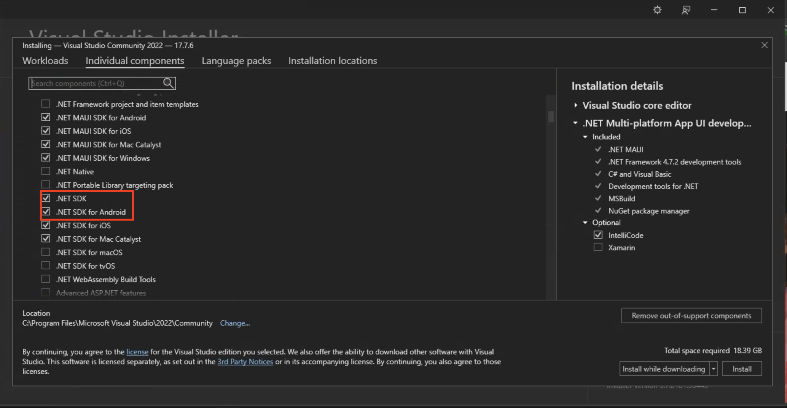
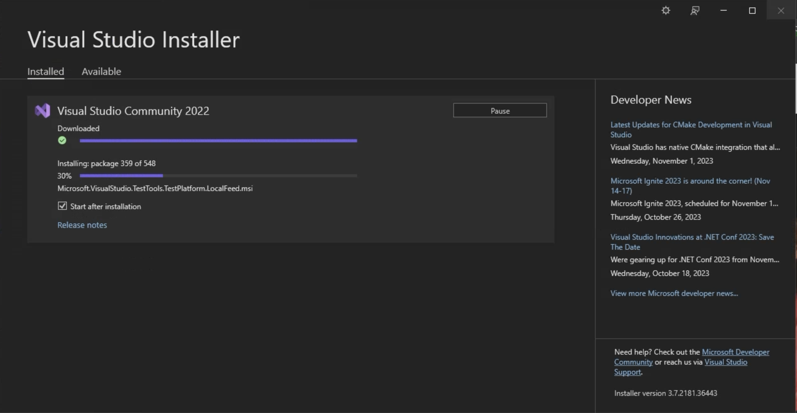
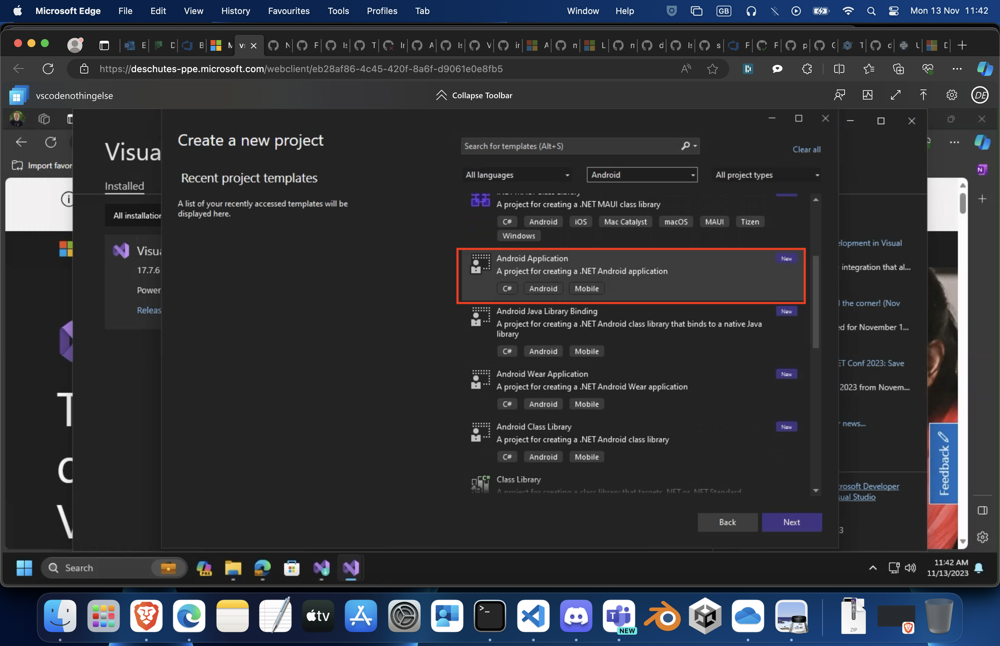

# Install .NET for Android

Developing native, .NET for Android apps requires dotnet 6 or higher. Various IDE's can be used however
we recommend Visual Studio 2022 17.3 or greater, or Visual Studio Code.

<!-- markdownlint-disable MD025 -->
## [Install via the Command Prompt or Terminal](#tab/commandline)
<!-- markdownlint-enable MD025 -->

* Install the latest .net <https://dotnet.microsoft.com/download> for your particular platform
  and follow its installation instructions <dotnet/core/install>.

* From a Command Prompt or Terminal run:

    ```dotnet
    dotnet workload install android
    ```

* In order to build Android applications you also need to install the [Android SDK and Java Sdk](dependencies.md#using-installandroiddependencies).


<!-- markdownlint-disable MD025 -->
## [Install via Visual Studio](#tab/visualstudio)
<!-- markdownlint-enable MD025 -->

* Install the latest Visual Studio <https://visualstudio.microsoft.com/downloads/>
* Select the .NET Multi Platform App UI Development and any other workloads you want.

  
* Or select the .NET for Android SDK from the Individual Components Tab.

  
* Let the installer run, it may take a while depending on your Internet Connection.

  
* Once installed you can run Visual Studio. You will be presented with the start up screen.
  Select New Project

  
* Look through the templates to find the Android Application Template

  
