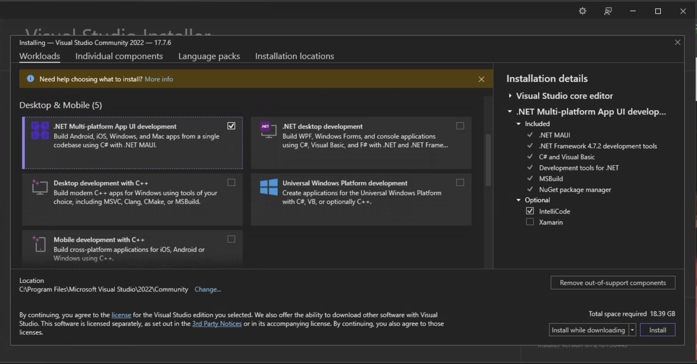
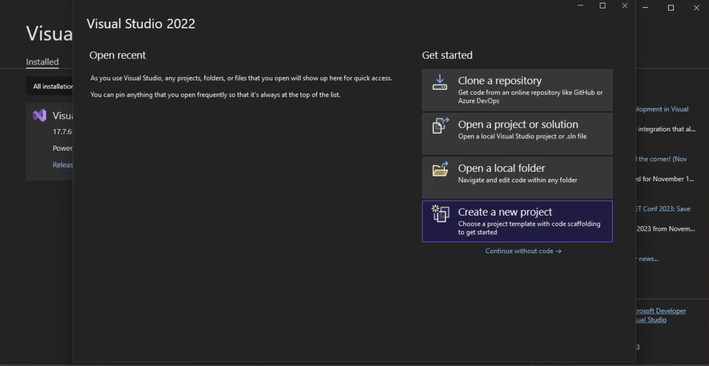

# Install .NET Android

Developing native, .NET Android apps requires dotnet 6 or higher. Various IDE's can be used however
we recommend Visual Studio 2022 17.3 or greater, or Visual Studio Code.

<!-- markdownlint-disable MD025 -->
## [Install via the Command Prompt or Terminal](#tab/commandline)
<!-- markdownlint-enable MD025 -->

* Install the latest .net <https://dotnet.microsoft.com/download> for your particular platform
  and follow its installation instructions <dotnet/core/install>.
* From a Command Prompt or Terminal run `dotnet workload install android`.
* Create a directory in which you want to create your project. Note the project will take on the
  name of the Folder as its project name. So if the directory is called "App1" you will get a
  project called "App1.csproj" created. It is recommended that you avoid using spaces or special
  characters in your project name or path. This helps to eliminate potential issues with the
  native tooling on various platforms (especially windows).
* In the Command Prompt or Terminal change to the directory you just created and run `dotnet new android`.
  You can use the `-n` argument if you want tp specify a particular project name. If you do not provide this argument it will use the Folder name by default.
* In order to build Android applications you also need to install the [Android SDK and Java Sdk](./installdependencies.md#using-installandroiddependencies).

<!-- markdownlint-disable MD025 -->
## [Install via Visual Studio](#tab/visualstudio)
<!-- markdownlint-enable MD025 -->

* Install the latest Visual Studio <https://visualstudio.microsoft.com/downloads/>
* Select the .NET Multi Platform App UI Development and any other workloads you want.

  
* Or select the .Net Android SDK from the Individual Components Tab. 

  
* Let the installer run, it may take a while depending on your Internet Connection.

  
* Once installed you can run Visual Studio. You will be presented with the start up screen.
  Select New Project

  
* Look through the templates to find the Android Application Template

  
