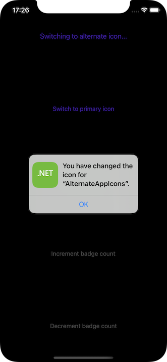
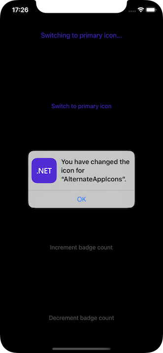

# Alternate app icons in .NET for iOS and tvOS

Apple has several [UIApplication][uiapplication] APIs that allow an app to manage its icon:

- [UIApplication.SupportsAlternateIcons][supportsalternateicons] - If `true` the app has an alternate set of icons.
- [UIApplication.AlternateIconName][alternateiconname] - Returns the name of the alternate icon currently selected or `null` if using the primary icon.
- [UIApplication.SetAlternateIconName][setalternateiconname] - Use this method to switch the app's icon to the given alternate icon.
- `UNUserNotificationCenter.Current.SetBadgeCount` - Sets the badge count of the app icon in the Springboard (deprecated in iOS 16+ and tvOS 16+).



## Adding Alternate Icons to a .NET Project

To allow an app to switch to an alternate icon, a new `.appiconset` folder with a collection of icon images will need to be included in the project's asset catalog.

Do the following:

1. Open the project's asset catalog (**Assets.xcassets**) in Finder:

    

2. Create a copy of the existing `AppIcon.appiconset` folder:

    

3. Replace each icon in the copied folder with the new icon of the matching size:

    

4. Add the app icon to the project file using the `AppIcon` property:

    ```xml
    <PropertyGroup>
        <AppIcon>AppIcon</AppIcon>
    </PropertyGroup>
    ```

    > [!NOTE]
    Existing projects typically specifies the app icon using the
    `XSAppIconAssets` key in the `Info.plist` file - this can still be used,
    but it's recommended to switch to the `AppIcon` property in the project
    file instead (which is simplier too, because its value is the name of the
    icon, not the path to the resource).

5. Add the alternative icon(s) to the project file using the `AlternativeAppIcons` item group:

    ```xml
    <ItemGroup>
        <AlternativeAppIcon Include="AlternativeAppIcons" />
    </ItemGroup>
    ```

## Managing the App's Icon 

With the icon images included in the .NET project, the developer can the following ways to control the app's icon.

The [SupportsAlternateIcons][supportsalternateicons] property of the [UIApplication][uiapplication] class allows the developer to see if an app supports alternate icons. For example:

```csharp
// Can the app select a different icon?
primaryIconButton.Enabled = UIApplication.SharedApplication.SupportsAlternateIcons;
alternateIconButton.Enabled = UIApplication.SharedApplication.SupportsAlternateIcons;
```

The [ApplicationIconBadgeNumber][applicationiconbadgenumber] property of the [UIApplication][uiapplication] class allows the developer to get or set the current badge number of the app icon in the Springboard. The default value is zero (0). For example:

```csharp
// Set the badge number to 1
var badgeCount = 1;
UNUserNotificationCenter.Current.SetBadgeCount (badgeCount, (error) => {
    Console.WriteLine ($"Set badge count to {badgeCount}: {(error is null ? "successfully" : error.ToString ())}");
}
```

> [!NOTE]
`UNUserNotificationCenter.SetBadgeCount` requires authorization from the user on iOS, which can be acquired by calling `UNUserNotificationCenter.Current.RequestAuthorization` before setting the badge count.

The [AlternateIconName][alternateiconname] property of the [UIApplication][uiapplication] class allows the developer to get the name of the currently selected alternate app icon or it returns `null` if the app is using the Primary Icon. For example:

```csharp
// Get the name of the currently selected alternate
// icon set
var name = UIApplication.SharedApplication.AlternateIconName;

if (name != null ) {
    // Do something with the name
}
```

The [SetAlternameIconName][setalternateiconname] property of the [UIApplication][uiapplication] class allows the developer to change the app icon. Pass the name of the icon to select or `null` to return to the primary icon. For example:

```csharp
void UsePrimaryIcon (Foundation.NSObject sender)
{
    UIApplication.SharedApplication.SetAlternateIconName (null, (error) => {
        Console.WriteLine ($"Set Primary Icon: {(error is null ? "successfully" : error.ToString ())}");
    });
}

void UseAlternateIcon (Foundation.NSObject sender)
{
    UIApplication.SharedApplication.SetAlternateIconName ("AlternateAppIcons", (error) => {
        Console.WriteLine ($"Set Alternate Icon: {(error is null ? "successfully" : error.ToString ())}");
    });
}
```

When the app is run and the user selects an alternate icon, an alert like the following will be displayed:


If the user switches back to the primary icon, an alert like the following will be displayed:



## See also

- [iOS sample](https://github.com/dotnet/macios-samples/pull/2)
- [tvOS sample](https://github.com/dotnet/macios-samples/pull/2)

[uiapplication]: xref:UIKit.UIApplication
[applicationiconbadgenumber]: xref:UIKit.UIApplication.ApplicationIconBadgeNumber
[supportsalternateicons]: xref:UIKit.UIApplication.SupportsAlternateIcons
[alternateiconname]: xref:UIKit.UIApplication.AlternateIconName
[setalternateiconname]: xref:UIKit.UIApplication.SetAlternateIconName%2A
