# User notifications

The User Notifications framework allows for the delivery and handling of local and remote notifications. Using this framework, an app or app extension can schedule the delivery of local notifications by specifying a set of conditions such as location or time of day.

Additionally, the app or extension can receive (and potentially modify) both local and remote notifications as they are delivered to the user's device.

The User Notification UI framework allows an app or app extension to customize the appearance of both local and remote notifications when they are presented to the user.

This framework provides the following ways that an app can deliver notifications to a user:

- Visual alerts: where the notification rolls down from the top of the screen as a banner.
- Sound and vibrations: can be associated with a notification.
- App icon badging: where the app's icon displays a badge showing that new content is available, such as the number of unread email messages.

Additionally, depending on the user's current context, there are different ways that a notification will be presented:

- If the device is unlocked, the notification will roll down from the top of the screen as a banner.
- If the device is locked, the notification will be displayed on the user's lock screen.
- If the user has missed a notification, they can open the Notification Center and view any available, waiting notifications there.

An app is able to send two types of user notifications:

- Local notifications: these are sent by apps installed locally on the users device.
- Remote notifications: are sent from a remote server and either presented to the user or they trigger a background update of the app's content.

### About local notifications

The local notifications that an app can send have the following features and attributes:

- They are sent by apps that are local on the user's device. 
- They are can be configured to use either time or location based triggers. 
- The app schedules the notification with the user's device and it is displayed when the trigger condition is met.
- When the user interacts with a notification, the app will receive a callback.

Some examples of local notifications include:

- Calendar alerts
- Reminder alerts
- Location aware triggers

For more information, please see Apple's [User Notifications](https://developer.apple.com/documentation/usernotifications) documentation.

### About remote notifications

The remote notifications that an app can send have the following features and attributes:

- The app has a server-side component that it communicates with.
- The Apple Push Notification Service (APNs) is used to transmit a best-effort delivery of remote notifications to the user's device from the developer's cloud based servers.
- When the app receives the remote notification it will be displayed to the user.
- When the user interacts with the notification, the app will receive a callback.

Some examples of Remote Notifications include:

- News alerts
- Sports updates
- Instant messaging messages

There are two types of remote notifications available to an app:

- User facing: these are displayed to the user on the device.
- Silent updates: these provide a mechanism to update the contents of an app in the background. When a silent update is received, the app can reach out to the remote servers to pull down the latest content.

For more information, please see Apple's [User Notifications](https://developer.apple.com/documentation/usernotifications) documentation.

### UIApplication API

It's possible to use [UIApplication][uiapplication] to register a notification with the system and to schedule how that notification should be triggered - either by time or location (this was the original API provided for user notifications by Apple).

However, there are several issue that a developer might encounter when working with the existing notification as provided by [UIApplication][uiapplication]:

- There are different callbacks required for local or remote notifications which could lead to duplication of code.
- The app has limited control of the notification after it had been scheduled with the system.
- There are differing levels of support across all of Apple's existing platforms.

### About the User Notifications framework

To improve the experience with notifications, Apple introduced the User Notifications framework, which replaces the existing [UIApplication][uiapplication] method noted above.

The User Notifications framework provides the following:

- A familiar API that includes feature parity with the previous methods making it easy to port code from the existing framework.
- Includes an expanded set of content options that allows richer notifications to be sent to the user.
- Both local and remote notifications can be handled by the same code and callbacks.
- Simplifies the process of handling callbacks that are sent to an app when the user interacts with a notification.
- Enhanced management of both pending and delivered notifications including the ability to remove or update notifications.
- Adds the ability to do in-app presentation of notifications.
- Adds the ability to schedule and handle notifications from within app extensions.
- Adds new extension point for the notifications themselves. 

The User Notifications framework provides a unified notification API across the multiple of the platforms that Apple supports including: 

- iOS: Full support to manage and schedule notifications.
- tvOS: Adds the ability to badge app icons for local and remote notifications.
- Mac Catalyst: Full support to manage and schedule notifications.
- macOS: Full support to manage and schedule notifications.

For more information, please see Apple's [User Notifications](https://developer.apple.com/reference/usernotifications) and [User Notifications UI](https://developer.apple.com/reference/usernotificationsui) documentation.

## Preparing for notification delivery

Before an app can send notifications to the user the app must be registered with the system and, because a notification is an interruption to the user, an app must explicitly request permission before sending them.

There are three different levels of notification requests that the user can approve for an app:

- Banner displays.
- Sound alerts.
- Badging the app icon.

Additionally, these approval levels must be requested and set for both local and remote notifications.

Notification permission should be requested as soon as the app launches by adding the following code to the `FinishedLaunching` method of the `AppDelegate` and setting the desired notification type (`UNAuthorizationOptions`):

```csharp
using UserNotifications;

public override bool FinishedLaunching (UIApplication application, NSDictionary launchOptions)
{
    // Request notification permissions from the user
    UNUserNotificationCenter.Current.RequestAuthorization (UNAuthorizationOptions.Alert, (approved, error) => {
        // Handle approval (or disapproval)
    });

    return true;
}
```

On macOS do it in the `DidFinishLaunching` implementation:

```csharp
using UserNotifications;

public override void DidFinishLaunching (NSNotification notification)
{
    // Request notification permissions from the user
    UNUserNotificationCenter.Current.RequestAuthorization (UNAuthorizationOptions.Alert | UNAuthorizationOptions.Badge | UNAuthorizationOptions.Sound, (approved, error) => {
        // Handle approval (or disapproval)
    });
}
```

> [!NOTE]
> macOS and Mac Catalyst apps must be signed for the permission dialog to appear, even when building locally in Debug mode.
> Set the [EnableCodeSigning][enablecodesigning] property in the project file to `true` to force the app to be signed.

Additionally, a user can always change the notification privileges for an app at any time using the **Settings** app on the device. The app should check for the user's requested notification privileges before presenting a notification using the following code:

```csharp
// Get current notification settings
UNUserNotificationCenter.Current.GetNotificationSettings ((settings) => {
    var alertsAllowed = (settings.AlertSetting == UNNotificationSetting.Enabled);
});
```

### Enabling background notifications

In order for the app to receive background notifications, it must enable the remote notifications background mode to the app.

This is done by adding a `remote-notifications` entry to the `UIBackgroundModes` array in the project's `Info.plist` file, like this:

```xml
<key>UIBackgroundModes</key>
<array>
    <string>remote-notification</string>
</array>
```

### Configuring the remote notifications environment

The developer must inform the OS what environment push notification are running in as either `development` or `production`. Failure to provide this information can result in the app being rejected when submitted to the App Store with a notification similar to the following:

> Missing Push Notification Entitlement - Your app includes an API for Apple's Push Notification service, but the `aps-environment` entitlement is missing from the app's signature.

To provide the required entitlement, do the following:

1. Open the project file in the text editor of your choice.
2. Enter two `CustomEntitlements` items, like this:

    ```xml
    <ItemGroup>
        <CustomEntitlements Include="aps-environment" Type="String" Value="development" Condition="'$(Configuration)' != 'Release'" />
        <CustomEntitlements Include="aps-environment" Type="String" Value="production" Condition="'$(Configuration)' == 'Release'" />
    </ItemGroup>
    ```

    Note: if you use a different configuration than `Release` for to publish to the App Store, update the conditions accordingly.

> [!NOTE]
> The `aps-environment` can also be set in the `Entitlements.plist` file, which is historically how it's been done. The advantage of using the project file is that it's easier to automatically use the correct value for the entitlement, `development` or `production`, depending on the build configuration.

### Provisioning

The `aps-environment` entitlement from the previous section requires using a provisioning profile with the `Push Notifications` capability:

1. Go to the [Identifiers](https://developer.apple.com/account/resources/identifiers/list) section of the [Apple Developer](https://developer.apple.com/) site:

[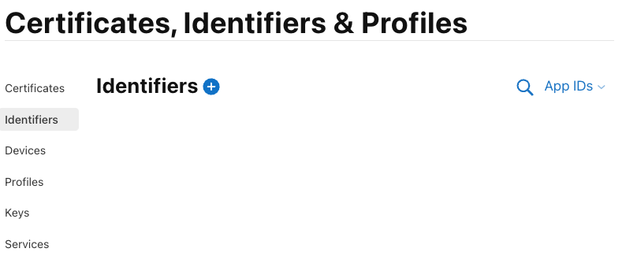](user-notifications-images/CreateAppIdentifier1.png#lightbox)

2. Add a new identifier (Register a new identifier):

[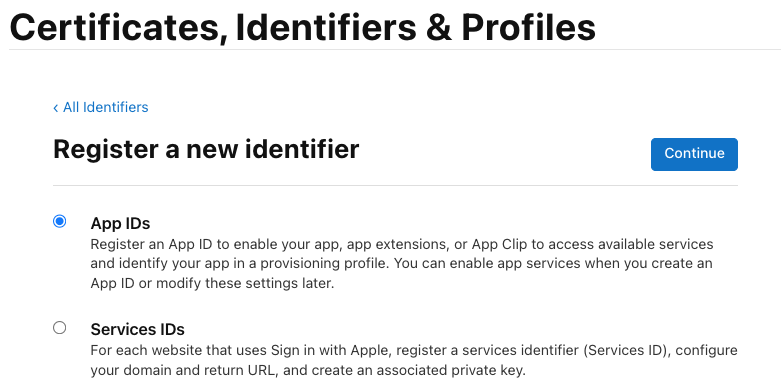](user-notifications-images/CreateAppIdentifier2.png#lightbox)

3. Select the 'App' type:

[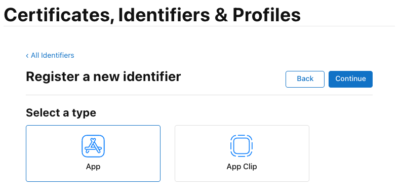](user-notifications-images/CreateAppIdentifier3.png#lightbox)

4. Enter the bundle identifier and description for the new app identifier:

[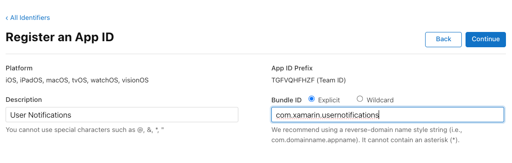](user-notifications-images/CreateAppIdentifier4.png#lightbox)

5. Enable the `Push Notifications` capability:

[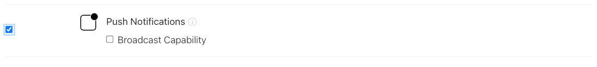](user-notifications-images/CreateAppIdentifier5.png#lightbox)

6. Click the `Register` to save the new app identifier.

The next step is to create a provisioning profile for the new app identifier:

1. Go to the [Profiles](https://developer.apple.com/account/resources/profiles/list) section of the [Apple Developer](https://developer.apple.com/) site:

[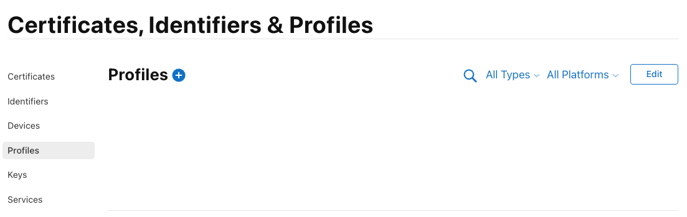](user-notifications-images/CreateProvisioningProfile1.png#lightbox)

2. Add a new profile for iOS App Development:

[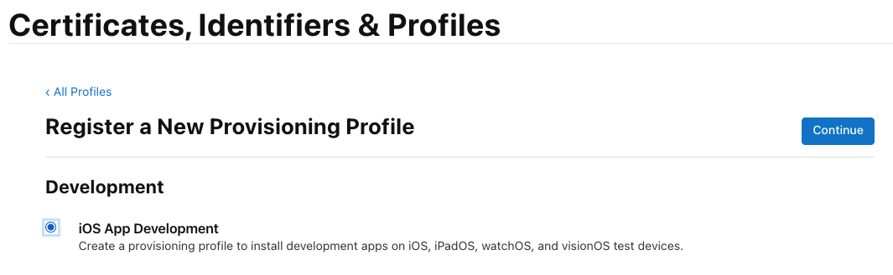](user-notifications-images/CreateProvisioningProfile2.png#lightbox)

3. Select the App ID we just created:

[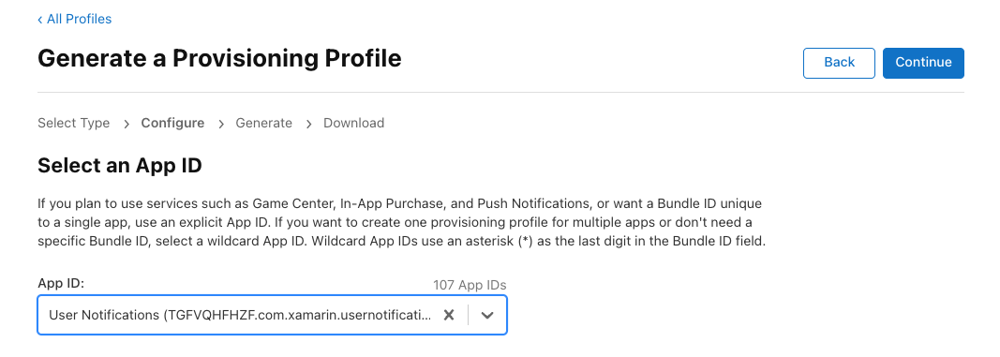](user-notifications-images/CreateProvisioningProfile3.png#lightbox)

4. Select all the certificates that are included in this provisioning profile (a new certificate must be craeted if none has been created yet):

[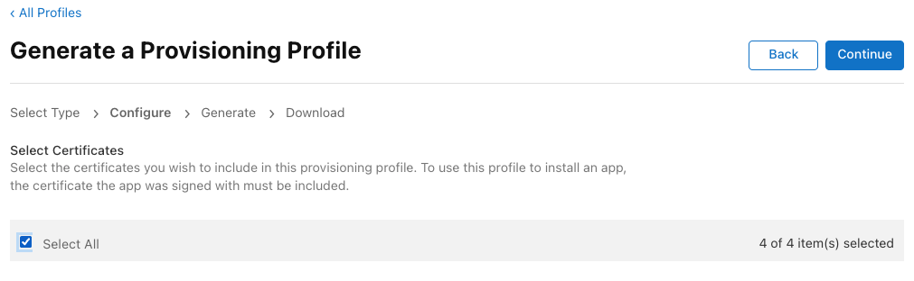](user-notifications-images/CreateProvisioningProfile4.png#lightbox)

5. Select all the devices that are included in this provisioning profile (the app can only be installed on these devices).

[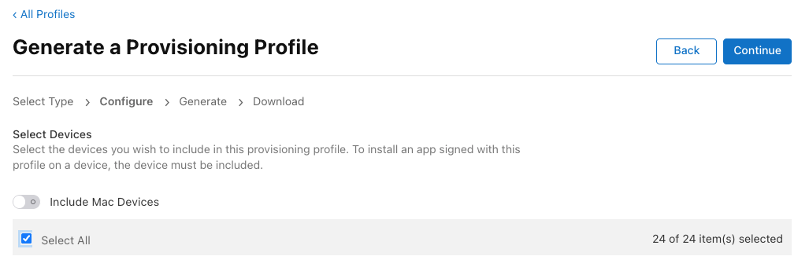](user-notifications-images/CreateProvisioningProfile5.png#lightbox)

6. Choose a name for the provisioning profile and review it:

[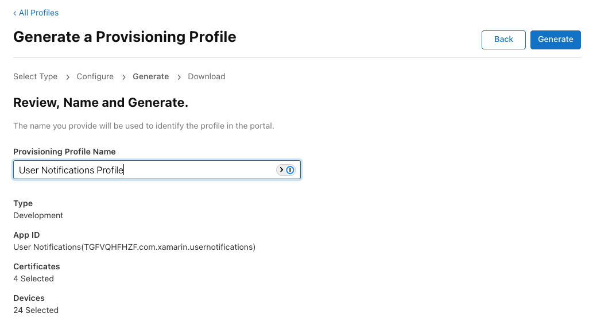](user-notifications-images/CreateProvisioningProfile6.png#lightbox)

7. Generate and download the new provisioning profile.

[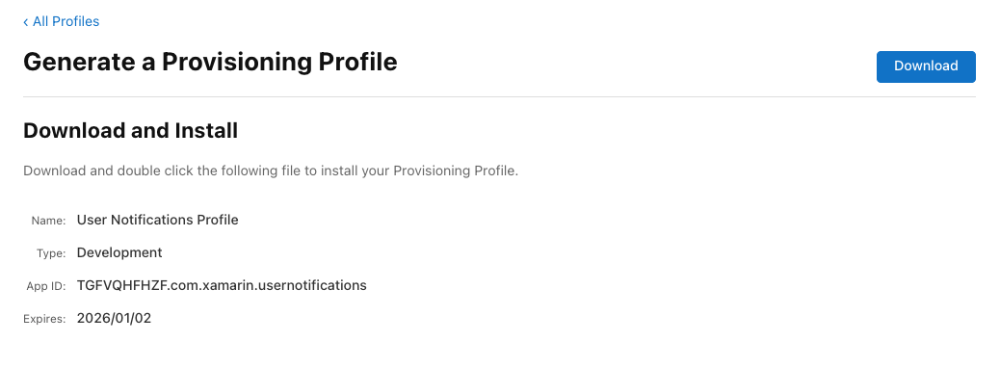](user-notifications-images/CreateProvisioningProfile7.png#lightbox)

8. Open the downloaded provisioning profile file in Xcode (by double-clicking on it in Finder) to install it into the system.

9. Configure the project to use the newly created provisioning profile by setting the `CodesignProvision` property to the name of the provisioning profile from step 6:

```xml
<PropertyGroup>
    <CodesignProvision>User Notifications Profile</CodesignProvision>
</PropertyGroup>
```

> [!NOTE]
> If the app has any app extensions that deal with notifications, this process must be repeated for each corresponding app extension project - they must each have their own app identifier and provisioning profile.

### Registering for remote notifications

If the app will be sending and receiving remote notifications, it will still need to do _Token Registration_ using the existing [UIApplication][uiapplication] API. This registration requires the device to have a live network connection to access APNs, which will generate the necessary token that will be sent to the app. The app needs to then forward this token to the developer's server side app to register for remote notifications:

[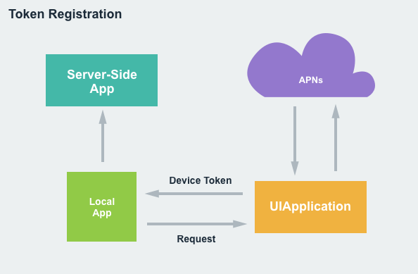](user-notifications-images/token01.png#lightbox)

Use the following code to initialize the required registration:

```csharp
UIApplication.SharedApplication.RegisterForRemoteNotifications ();
```

The token that gets sent to the developer's server side app will need to be included as part of the notification payload that get's sent from the server to APNs when sending a remote notification:

[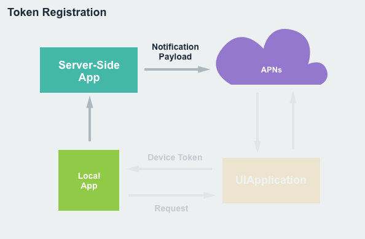](user-notifications-images/token02.png#lightbox)

The token acts as the key that ties together the notification and the app used to open or respond to the notification.

For more information, please see Apple's [User Notifications](https://developer.apple.com/documentation/usernotifications) documentation.

## Notification delivery

With the app fully registered and the required permissions requested from and granted by the user, the app is now ready to send and receive notifications. 

### Providing notification content

All notifications contain both a **Title** and **Subtitle** that will always be displayed with the **Body** of the notification content. There is also the ability to add **Media Attachments** to the notification content.

To create the content of a local notification, use the following code:

```csharp
var content = new UNMutableNotificationContent();
content.Title = "Notification Title";
content.Subtitle = "Notification Subtitle";
content.Body = "This is the message body of the notification.";
content.Badge = 1;
```

For remote notifications, the process is similar:

```json
{
    "aps":{
        "alert":{
            "title":"Notification Title",
            "subtitle":"Notification Subtitle",
            "body":"This is the message body of the notification."
        },
        "badge":1
    }
}
```

### Scheduling when a notification is sent

With the content of the notification created, the app needs to schedule when the notification will be presented to the user by setting a *trigger*. There are four different trigger types:

- Push notification - Used exclusively with remote notifications and is triggered when APNs sends a notification package to the app running on the device.
- Time interval - Allows a local notification to be scheduled from a time interval start with now and ending a some future point. For example:
    ```csharp
    var trigger = UNTimeIntervalNotificationTrigger.CreateTrigger (5, false);
    ```
- Calendar date - Allows local notifications to be scheduled for a specific date and time.
- Location based - Allows local notifications to be scheduled when the device is entering or leaving a specific geographic location or is in a given proximity to any Bluetooth beacons.

When a local notification is ready, the app needs to call [UNUserNotificationCenter.AddNotificationRequest][unusernotificationcenter_addnotificationrequest] schedule its display to the user. For remote notifications, the server-side app sends a notification payload to the APNs, which then sends the packet on to the user's device.

Bringing all of the pieces together, a sample local notification might look like:

```csharp
using UserNotifications;

public void SendLocalNotification ()
{
    var content = new UNMutableNotificationContent ();
    content.Title = "Notification Title";
    content.Subtitle = "Notification Subtitle";
    content.Body = "This is the message body of the notification.";
    content.Badge = 1;

    var trigger =  UNTimeIntervalNotificationTrigger.CreateTrigger (5, false);

    var requestId = "sampleRequest";
    var request = UNNotificationRequest.FromIdentifier (requestId, content, trigger);

    UNUserNotificationCenter.Current.AddNotificationRequest (request, (err) => {
        if (err is not null) {
            // Do something with error
        }
    });
}
```

### Triggering a remote notification

There are a multiple ways to trigger a remote notification during development for testing:

* [Apple's Push Notification Console](https://developer.apple.com/documentation/usernotifications/testing-notifications-using-the-push-notification-console)
* [Command line tools](https://developer.apple.com/documentation/usernotifications/sending-push-notifications-using-command-line-tools)
* Other third-party solutions.

Once the app is released, remote notifications are typically triggered from server-side apps.

## Handling foreground app notifications

An app can handle notifications differently when it is in the foreground and a notification is triggered. By providing a [UNUserNotificationCenterDelegate][unusernotificationcenterdelegate] and implementing the [WillPresentNotification][unusernotificationcenterdelegate_willpresentnotification] method, the app can take over responsibility for displaying the notification. For example:

```csharp
using System;
using UserNotifications;

public class UserNotificationCenterDelegate : UNUserNotificationCenterDelegate
{
    #region Constructors
    public UserNotificationCenterDelegate ()
    {
    }
    #endregion

    #region Override Methods
    public override void WillPresentNotification (UNUserNotificationCenter center, UNNotification notification, Action<UNNotificationPresentationOptions> completionHandler)
    {
        // Do something with the notification
        Console.WriteLine ("Active notification: {0}", notification);

        // Tell system to display the notification anyway or use
        // `None` to say we have handled the display locally.
        completionHandler (UNNotificationPresentationOptions.Alert);
    }
    #endregion
}
```

This code is simply writing out the contents of the [UNNotification][unnotification] to the Application Output and asking the system to display the standard alert for the notification. 

If the app wanted to display the notification itself when it was in the foreground, and not use the system defaults, pass [None][unnotificationpresentationoptions_none] to the completion handler. Example:

```csharp
completionHandler (UNNotificationPresentationOptions.None);
```

With this code in place, open the `AppDelegate.cs` file for editing and change the `FinishedLaunching` method to look like the following:

```csharp
public override bool FinishedLaunching (UIApplication application, NSDictionary launchOptions)
{
    // Request notification permissions from the user
    UNUserNotificationCenter.Current.RequestAuthorization (UNAuthorizationOptions.Alert, (approved, err) => {
        // Handle approval
    });

    // Watch for notifications while the app is active
    UNUserNotificationCenter.Current.Delegate = new UserNotificationCenterDelegate ();

    return true;
}
```

This code is attaching the custom [UNUserNotificationCenterDelegate][unusernotificationcenterdelegate] from above to the current [UNUserNotificationCenter][unusernotificationcenter] so the app can handle notification while it is active and in the foreground.

## Notification management

Notification management provides access to both pending and delivered notifications and adds the ability to remove, update or promote these notifications.

An important part of notification management is the _request identifier_ that was assigned to the notification when it was created and scheduled with the system. For remote notifications, this is assigned via the `apps-collapse-id` field in the HTTP request header.

The request identifier is used to select the notification that the app wishes to perform notification management on.

### Removing notifications

To remove a pending notification from the system, use the following code:

```csharp
var requests = new string [] { "sampleRequest" };
UNUserNotificationCenter.Current.RemovePendingNotificationRequests (requests);
```

To remove an already delivered notification, use the following code:

```csharp
var requests = new string [] { "sampleRequest" };
UNUserNotificationCenter.Current.RemoveDeliveredNotifications (requests);
```

### Updating an existing notification

To update an existing notification, simply create a new notification with the desired parameters modified (such as a new trigger time) and add it to the system with the same request identifier as the notification that needs to be modified. Example:

```csharp
using UserNotifications;

// Rebuild notification
var content = new UNMutableNotificationContent ();
content.Title = "Notification Title";
content.Subtitle = "Notification Subtitle";
content.Body = "This is the message body of the notification.";
content.Badge = 1;

// New trigger time
var trigger = UNTimeIntervalNotificationTrigger.CreateTrigger (10, false);

// Id of notification to be updated
var requestId = "sampleRequest";
var request = UNNotificationRequest.FromIdentifier (requestId, content, trigger);

// Add to system to modify existing Notification
UNUserNotificationCenter.Current.AddNotificationRequest (request, (err) => {
    if (err != null) {
        // Do something with error...
    }
});
```

For already delivered notifications, the existing notification will get updated and promoted to the top of the list on the Home and Lock screens and in the Notification Center if it has already been read by the user.

## Working with notification actions

Notifications that are delivered to the user are not static, and provide several ways that the user can interact with them (from built-in to custom actions).

There are three types of actions that an app can respond to:

- Default action - This is when the user taps a notification to open the app and display the details of the given notification.
- Custom actions - These provide a quick way for the user to perform a custom task directly from the notification without needing to launch the app. They can be presented as either a list of buttons with customizable titles or a text input field which can run either in the background (where the app is given a small amount of time to fulfill the request) or the foreground (where the app is launched in the foreground to fulfill the request).
- Dismiss action - This action is sent to the app when the user dismisses a given notification.

### Creating custom actions

To create and register a custom action with the system, use the following code:

```csharp
// Create action
var actionId = "reply";
var title = "Reply";
var action = UNNotificationAction.FromIdentifier (actionId, title, UNNotificationActionOptions.None);

// Create category
var categoryId = "message";
var actions = new UNNotificationAction [] { action };
var intentIds = new string [] { };
var categoryOptions = new UNNotificationCategoryOptions [] { };
var category = UNNotificationCategory.FromIdentifier (categoryId, actions, intentIds, UNNotificationCategoryOptions.None);
    
// Register category
var categories = new UNNotificationCategory [] { category };
UNUserNotificationCenter.Current.SetNotificationCategories (new NSSet<UNNotificationCategory>(categories)); 
```

When creating a new [UNNotificationAction][unnotificationaction], it is assigned a unique identifier and the title that will appear on the button. By default, the action will be created as a background action, however options can be supplied to adjust the action's behavior (for example setting it to be a foreground action).

Each of the actions created need to be associated with a category. When creating a new [UNNotificationCategory][unnotificationcategory], it is assigned a unique identifier, a list of actions it can perform, a list of intent identifiers to provide more information about the intent of the actions in the category and some options to control the behavior of the category.

Finally, all of the categories are registered with the system using the [SetNotificationCategories][unusernotificationcenter_setnotificationcategories] method.

### Presenting custom actions

Once a set of custom actions and categories have been created and registered with the system, they can be presented from either local or remote notifications.

For remote notifications, set a `category` in the remote notification payload that matches one of the categories created above. For example:

```json
{
    aps: {
        alert:"Hello world!",
        category:"message"
    }
}
```

For local notifications, set the `CategoryIdentifier` property of the `UNMutableNotificationContent` object. For example:

```csharp
var content = new UNMutableNotificationContent ();
content.Title = "Notification Title";
content.Subtitle = "Notification Subtitle";
content.Body = "This is the message body of the notification.";
content.Badge = 1;
content.CategoryIdentifier = "message";
```

Again, this identifier needs to match one of the categories that was created above.

### Handling dismiss actions

As stated above, a dismiss action can be sent to the app when the user dismisses a notification. Since this is not a standard action, a option will need to be set when the category is created. For example:

```csharp
var categoryId = "message";
var actions = new UNNotificationAction [] { action };
var intentIds = new string [] { };
var categoryOptions = new UNNotificationCategoryOptions [] { };
var category = UNNotificationCategory.FromIdentifier (categoryId, actions, intentIds, UNNotificationCategoryOptions.CustomDismissAction);
```

### Handling action responses

When the user interacts with the custom actions and categories that were created above, the app needs to fulfill the requested task. This is done by providing a [UNUserNotificationCenterDelegate][unnsernotificationcenterdelegate] and implementing the [DidReceiveNotificationResponse][unusernotificationcenterdelegate_didreceivenotificationresponse] method. For example:

```csharp
using System;
using UserNotifications;

namespace MonkeyNotification
{
    public class UserNotificationCenterDelegate : UNUserNotificationCenterDelegate
    {
        ...

        #region Override methods
        public override void DidReceiveNotificationResponse (UNUserNotificationCenter center, UNNotificationResponse response, Action completionHandler)
        {
            // Take action based on Action ID
            switch (response.ActionIdentifier) {
            case "reply":
                // Do something
                break;
            default:
                // Take action based on identifier
                if (response.IsDefaultAction) {
                    // Handle default action...
                } else if (response.IsDismissAction) {
                    // Handle dismiss action
                }
                break;
            }

            // Inform caller it has been handled
            completionHandler();
        }
        #endregion
    }
}
```

The passed in `UNNotificationResponse` class has an `ActionIdentifier` property that can either be the default action or the dismiss action. Use `response.Notification.Request.Identifier` to test for any custom actions.

The `UserText` property holds the value of any user text input. The `Notification` property holds the originating notification that includes the request with the trigger and notification content. The app can decide if it was a local or remote notification based on the type of trigger.

## Working with Notification Service extensions

When working with remote notifications, a _Notification Service Extension_ provide a way to enable end-to-end encryption inside of the notification payload. A Notification Service extension is a non-User Interface extension that runs in the background with the main purpose of augmenting or replacing the visible content of a notification before it is presented to the user. 

[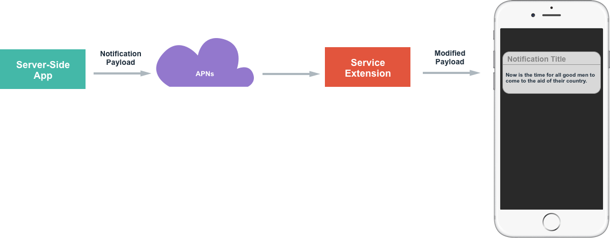](user-notifications-images/extension01.png#lightbox)

Notification Service extensions are meant to run quickly and are only given a short amount of time to execute by the system. In the event that the Notification Service extension fails to complete its task in the allotted amount of time, a fallback method will be called. If the fallback fails, the original notification content will be displayed to the user.

Some potential uses of Notification Service extensions include:

- Providing end-to-end encryption of the remote notification content.
- Adding attachments to remote notifications to enrich them.

### Implementing a Notification Service extension

To implement a Notification Service extension in an app, do the following:

1. Create a new folder for the extension project, next to the main project's folder. The following instructions assume the new folder is named `MyNotificationServiceExtension`.
2. Open a terminal, and execute:

    ```dotnetcli
    dotnet new ios-notification-service-extension
    ```
3. Open the main project's project file, and add:

    ```xml
    <ItemGroup>
        <ProjectReference Include="..\MyNotificationServiceExtension\MyNotificationServiceExtension.csproj">
            <IsAppExtension>true</IsAppExtension>
        </ProjectReference>
    </ItemGroup>
    ```
4. Now build the main project, and the extension project will also be built and included in the final app bundle.

> [!IMPORTANT]
> Due to changes in how the interaction between a Mac and any connected devices is handled by the Mac, it's currently not possible to debug an app extension with a debugger. See also https://github.com/xamarin/xamarin-macios/issues/19484 for more up-to-date information.
> 
> This means that the most reliable way to debug an app extension is unfortunately to add Console.WriteLine statements to the code, and then look for those statements in the [device log](https://support.apple.com/en-in/guide/console/cnsl1012/mac).

> [!IMPORTANT]
> The bundle identifier (ApplicationId) for the service extension must be prefixed with the bundle identifier of the main app. For example, if the main app had a Bundle Identifier of  `com.xamarin.monkeynotify`, the service extension should have a Bundle Identifier of `com.xamarin.monkeynotify.monkeynotifyserviceextension`.

There is one main class in the Notification Service extension that will need to be modified to provide the required functionality. For example:

```csharp
using System;

using Foundation;
using UIKit;
using UserNotifications;

namespace MonkeyChatServiceExtension
{
    [Register ("NotificationService")]
    public class NotificationService : UNNotificationServiceExtension
    {
        protected NotificationServiceClass (NativeHandle handle) : base (handle)
        {
            // Note: this .ctor should not contain any initialization logic,
            // it only exists so that the OS can instantiate an instance of this class.
        }

        public override void DidReceiveNotificationRequest (UNNotificationRequest request, Action<UNNotificationContent> contentHandler)
        {
            // Called when the OS receives a notification that can be muteated

            // Create a mutable copy of the notification
            var mutableRequest = (UNMutableNotificationContent) request.Content.MutableCopy ();

            // Modify the notification content here...
            mutableRequest.Title = $"[modified] {mutableRequest.Title}";

            // Call the contentHandler callback to let the OS know about the modified notification.
            contentHandler (mutableRequest);
        }

        public override void TimeWillExpire ()
        {
            // Called just before the extension will be terminated by the system.
            // Use this as an opportunity to deliver your "best attempt" at modified content, otherwise the original push payload will be used.
        }
    }
}
```

The first method, [DidReceiveNotificationRequest][unnotificationserviceextension_didreceivenotificationrequest], will be passed the notification identifier as well as the notification content via the `request` object. The passed in `contentHandler` will need to be called to present the notification to the user.

The second method, [TimeWillExpire][unnotificationserviceextension_timewillexpire], will be called just before time is about to run out for the Notification Service extension to process the request. If the Notification Service extension fails to call the `contentHandler` in the allotted amount of time, the original content will be displayed to the user.

### Triggering a Notification Service extension

With a Notification Service extension created and delivered with the app, it can be triggered by modifying the remote notification payload sent to the device. For example:

```json
{
    aps : {
        alert : "New Message Available",
        mutable-content: 1
    },
    encrypted-content : "#theencryptedcontent"
}
```

The new `mutable-content` key specifies that the Notification Service extension will need to be launched to update the remote notification content. The `encrypted-content` key holds the encrypted data that the Notification Service extension can decrypt before presenting to the user.

Take a look at the following example Notification Service extension:

```csharp
using UserNotification;

namespace myApp {
    public class NotificationService : UNNotificationServiceExtension {
    
        public override void DidReceiveNotificationRequest(UNNotificationRequest request, contentHandler) {
            // Decrypt payload
            var decryptedBody = Decrypt(Request.Content.UserInfo["encrypted-content"]);
            
            // Modify notification body
            var newContent = new UNMutableNotificationContent();
            newContent.Body = decryptedBody;
            
            // Present to user
            contentHandler(newContent);
        }
        
        public override void TimeWillExpire() {
            // Handle out-of-time fallback event
        }
        
    }
}
```

This code decrypts the encrypted content from the `encrypted-content` key, creates a new [UNMutableNotificationContent][unmutablenotificationcontent], sets the [Body][unmutablenotificationcontent_body] property to the decrypted content and uses the `contentHandler` to present the notification to the user.

## See also

- [UserNotifications Framework Reference](https://developer.apple.com/reference/usernotifications)
- [UserNotificationsUI](https://developer.apple.com/reference/usernotificationsui)
- [Local and Remote Notification Programming Guide](https://developer.apple.com/documentation/usernotifications)
- [Customizing the Appearance of Notifications](https://developer.apple.com/documentation/usernotificationsui/customizing-the-appearance-of-notifications)

[enablecodesigning]: ../../building-apps/build-properties.md#enablecodesigning
[uiapplication]: xref:UIKit.UIApplication
[unnotification]: xref:UserNotifications.UNNotification
[unusernotificationcenter]: xref:UserNotifications.UNUserNotificationCenter
[unusernotificationcenter_addnotificationrequest]: xref:UserNotifications.UNUserNotificationCenter.AddNotificationRequest*
[unusernotificationcenter_setnotificationcategories]: xref:UserNotifications.UNUserNotificationCenter.SetNotificationCategories*
[unusernotificationcenterdelegate]: xref:UserNotifications.UNUserNotificationCenterDelegate
[unusernotificationcenterdelegate_willpresentnotification]: xref:UserNotifications.UNUserNotificationCenterDelegate.WillPresentNotification*
[unusernotificationcenterdelegate_didreceivenotificationresponse]: xref:UserNotifications.UNUserNotificationCenterDelegate.DidReceiveNotificationResponse*
[unnotificationpresentationoptions_none]: xref:UserNotifications.UNNotificationPresentationOptions.None
[unnotificationaction]: xref:UserNotifications.UNNotificationAction
[unnotificationcategory]: xref:UserNotifications.UNNotificationCategory
[unmutablenotificationcontent]: xref:UserNotifications.UNMutableNotificationContent
[unmutablenotificationcontent_body]: xref:UserNotifications.UNMutableNotificationContent.Body
[unnotificationserviceextension_timewillexpire]: xref:UserNotifications.UNNotificationServiceExtension.TimeWillExpire*
[unnotificationserviceextension_didreceivenotificationrequest]: xref:UserNotifications.UNNotificationServiceExtension.DidReceiveNotificationRequest*
