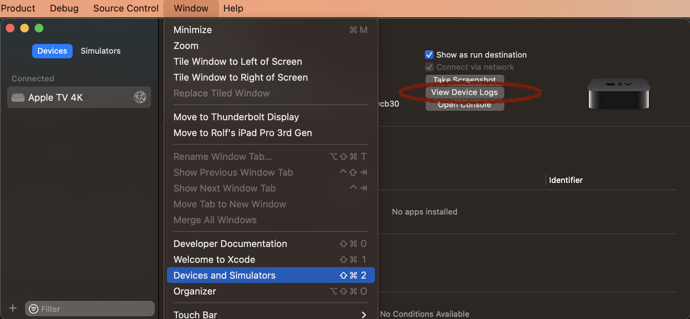

# How to diagnose crashes native crashes in .NET for iOS, tvOS, Mac Catalyst or macOS apps

The first part to diagnosing crash reports is to gather as much information as possible:

* [Crash reports](#crash-reports) (preferrably [symbolicated](#symbolication))
* [Device Logs](#device-logs)
* [Standard output / standard error](#standard-output--standard-error)

## Information gathering

The following sections describe how to get various types of information about native crashes.

### Crash reports

Crash reports for macOS, Mac Catalyst and apps in the simulator can be found in the `~/Library/Logs/DiagnosticReports` directory.

Crash reports for devices (iOS and tvOS), can be downloaded from Xcode.

Open the menu `Window -> Devices and Simulators`, select the device on the left, and click on `View Device Logs`:

[]

Then Xcode will download crash reports from that device (this may take a few seconds) and list them all.

Xcode will also automatically symbolicate the crash reports it downloads.

### Symbolication

"Symbolication" is the process of resolving a memory address into the name of the function that's executing, potentially with the file name and line number of the executing as well.

In order for symbolication to work correctly, it's required to have debug symbols available during the symbolication process.

The debug symbols can be in two places:

* Inside the executable or dynamic library itself (aka in the app). Typically these debug symbols are only able to resolve a memory address into a function name, but not the file name and line number of the source code.
* Inside a .dSYM bundle, separate from the app.

Symbols are automatically from the app for non-debug builds (to minimize app
size). It's possible to disable the removal of debug symbols from the app, by
setting the [`NoSymbolStrip`](../building-apps/build-properties.md#nosymbolstrip)
property to `true`. This can make the symbolication process easier in some
cases.

When symbolicating a native stack trace (for instance using a third-party
crash reporter), it's required to provide the .dSYM bundle to the third-party
crash reporter.

Note that each build will produce a different .dSYM bundle. There's a randomly
generated UUID embedded inside each native executable, which changes on every
build, and which is also embedded in the corresponding .dSYM bundle. This UUID
is used to find a .dSYM bundle given a particular executable, but it also
means that it's not possible to re-create a .dSYM bundle for an old build. In
order to symbolicate crash reports from an already published app, the .dSYM
bundle from the corresponding build must have been stored somewhere from when
the app was built. If this .dSYM bundle is not available anymore, the only
option is to rebuild and republish the app.

For debugging local builds the symbolication process will automatically find
the .dSYM bundle, as long as the project hasn't been rebuilt.

> [!TIP]
> The creation of the .dSYM bundle is controlled by the [`NoDSymUtil`](../building-apps/build-properties.md#nodsymutil) property in the project file.

> [!NOTE]
> If the interpreter is used, any interpreted methods won't be symbolicated into the correct managed frame, but instead into the interpreter's methods. In some cases it might be beneficial to disable the intepreter in order to get better native stack traces in crash reports.

### Device Logs

The device log for devices can be viewed in the Console app: https://support.apple.com/en-in/guide/console/cnsl1012/mac.

The log for the Mac can also be viewed in the Console app.

In many cases additional information will be printed to the console right before an app crashes, so this can be very useful.

### Standard output / standard error

In many cases extra information is printed to stdout/stderr when an app terminates.

This can sometimes be viewed in the Console app (see [Device Logs](#device-logs)), but it's also possible to get it directly in the terminal.

For desktop apps, launch them using `dotnet run -p:RunWithOpen=false`:

```shell
$ dotnet run -p:RunWithOpen=false
[ ... ]
```

For mobile apps, just run with `dotnet run`:

```shell
$ dotnet run
```

For more information about how to run mobile apps:

```shell
$ dotnet run -p:Help=true
```

## Diagnosis

The following sections describe how to diagnose crashes based on the information collected.

### Unhandled managed exceptions

If a managed exception goes unhandled, it will end up terminating the process.

This is fairly easy to identify, because there will be a stack frame somewhere containing `unhandled_exception` in some shape or form.

Example:

```
Triggered by Thread:  43
Thread 43 Crashed:
0   libsystem_kernel.dylib        	0x00000001ea9661dc __pthread_kill + 8 (:-1)
1   libsystem_pthread.dylib       	0x00000002242e0b40 pthread_kill + 268 (pthread.c:1721)
2   libsystem_c.dylib             	0x00000001a1d992d0 abort + 124 (abort.c:122)
3   MyApp                         	0x00000001011cba48 0x00000001008cfa48 (in MyApp) + 9239112
4   MyApp                         	0x00000001010d1dc8 mono_runtime_setup_stat_profiler + 0 (mini-posix.c:690)
5   libsystem_platform.dylib      	0x0000000224231eec _sigtramp + 56 (sigtramp.c:116)
6   libsystem_pthread.dylib       	0x00000002242e0b40 pthread_kill + 268 (pthread.c:1721)
7   libsystem_c.dylib             	0x00000001a1d992d0 abort + 124 (abort.c:122)
8   MyApp                         	0x0000000100d93140 xamarin_find_protocol_wrapper_type + 0 (runtime.m:1218)
9   MyApp                         	0x0000000100fed800 mono_invoke_unhandled_exception_hook + 156 (exception.c:1263)
10  MyApp                         	0x0000000101050658 start_wrapper + 1212 (threads.c:1271)
11  libsystem_pthread.dylib       	0x00000002242daafc _pthread_start + 136 (pthread.c:931)
12  libsystem_pthread.dylib       	0x00000002242daa04 thread_start + 8 (:-1)
```

Here frame 9 is `mono_invoke_unhandled_exception_hook`, so this is an unhandled exception.

Unfortunately the stack trace doesn't reveal anything about the managed exception that caused this.

The best way to diagnose this further is to add additional telemetry to the app, by adding an event handler to the [MarshalManagedException][xref:ObjCRuntime.Runtime.MarshalManagedException] event, logging any such marshalled exceptions. The last one will likely be the unhandled exception.

See [Exception marshaling](../advanced-concepts/exception-marshaling.md) for more information about exception marshalling.

>[!TIP]
> It's recommended to not "leak" any managed exceptions to native code, because such managed exceptions are converted into Objective-C exceptions, and Objective-C exceptions are much more _exceptional_ (Objective-C exceptions are to be used for programmer errors, not for expected circumstances during normal code flow [Programming with Objective-C - Dealing with Errors](https://developer.apple.com/library/archive/documentation/Cocoa/Conceptual/ProgrammingWithObjectiveC/ErrorHandling/ErrorHandling.html)).
